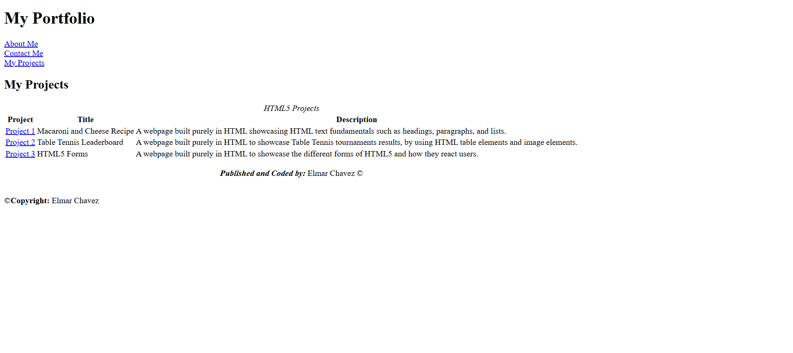

# 💻 My First Frontend Portfolio

## ℹ️ A Basic HTML Portfolio Website

A pure HTML website built as part of my earliest lessons in frontend development.

---

## 🔍 Overview

This project contains three mini-sites built entirely with HTML. At the time, I had no experience with **frontend web development**. This helped me understand the fundamentals of:

- Creating multi-page websites
- Using semantic HTML tags like `<main>`, `<section>`, `<header>`, and `<footer>`
- Building and styling tables
- Structuring forms
- Writing clean, readable code from the ground up

---

## 📚 Included Projects

- [Project 1 – Mac & Cheese Recipe](https://github.com/CodingWithJiro/beginner-portfolio-website-recipe)

  Practiced semantic elements and list structures with a recipe format.

- [Project 2 – Table Tennis Leaderboard](https://github.com/CodingWithJiro/beginner-portfolio-website-table-tennis)

  Learned how to use HTML tables to present scores and rankings.

- [Project 3 – HTML5 Forms](https://github.com/CodingWithJiro/beginner-portfolio-website-forms)

  Explored how HTML forms work and what kinds of inputs users can interact with.

---

## 🧠 What I Learned

- The importance of semantic HTML
- How to organize content visually and structurally
- How to manually link between pages using relative file paths
- That frontend development is something I really want to learn

---

## 🛠️ Tech Used

- HTML5
- Git
- GitHub
- Netlify

---

## 🚀 How to Run

1. Clone the repository
2. Open `index.html` in your browser

---

## 🌐 Live Demo

Or you can check out the 👉 [live website here](https://beginner-portfolio-website-jiro.netlify.app/)

---

## 🧑‍💻 Author

Created by **Elmar Chavez**

🗓️ Month/Year: **April 2025**

📚 Journey: **1st month** of learning _frontend web development_.
